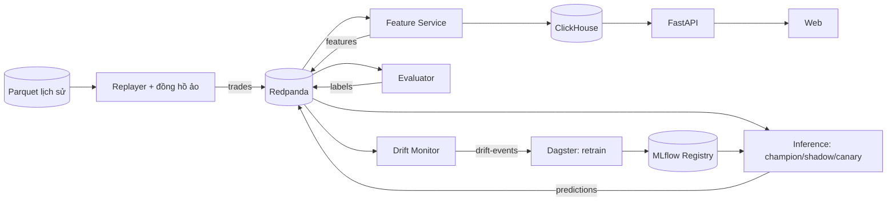

# Kiến trúc

```mermaid
flowchart LR
  P[(Parquet lịch sử)] --> R[Replayer + đồng hồ ảo]
  R -->|trades| K[(Redpanda)]
  K --> F[Feature Service]
  F -->|features| K
  F --> CH[(ClickHouse)]
  K --> I[Inference: champion/shadow/canary]
  ML[(MLflow Registry)] --> I
  I -->|predictions| K
  K --> E[Evaluator]
  E -->|labels| K
  K --> D[Drift Monitor]
  D -->|drift-events| DG[Dagster: retrain]
  DG --> ML
  CH --> API[FastAPI]
  API --> W[Web]
```

Ba vòng lặp ML: **dự đoán** (mỗi phút) → **chấm điểm** (khi nhãn đến) → **học lại** (hằng ngày hoặc khi drift).
